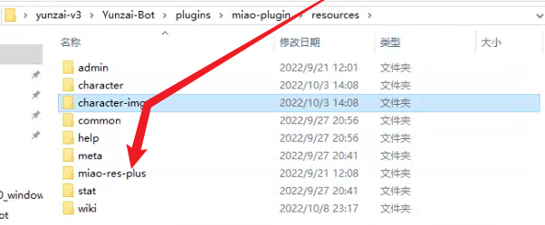

# 云崽 bot-v3 安装步骤

## 目前#更新面板坏了，具体我也不知道怎么办，有了解的可以告诉我

> 本教程支持的操作系统：Win10 及以上版本、**Windows Server 2019** 及以上版本  
> 下方密码统一为 **0000**  
> 以下命令如果没有特别指明的话，都是在**云崽根目录**下执行  
> 视频内的命令可能有误，**一切步骤以本安装教程内的为准**  
> 验证 ticket 时，最好使用 **新 edge** 浏览器

> 不支持 Windows Server 2012，如果云服务器无法安装 2019，那么请使用 Linux 系统(推荐 unbuntu)，具体教程看下方 Linux 安装教程

## (新)云崽启动器

- 最近两天随手搓了个云崽启动器，内置了云崽的**一键安装，一键启动，一键关闭，一键切换账号**，启动器本身**支持自动升级**，还有其它各种功能，以后可能还会加入各种 BUG 的一键修复，欢迎大家尝鲜使用

- 下载地址 [https://yshs.lanzouy.com/b0a0adzaj
  ](https://yshs.lanzouy.com/b0a0adzaj) 密码 0000

- 前置条件：电脑需要装有 `git` 和 `node.js`

- 使用教程：把启动器下载好，放到与 `Yunzai-bot` 文件夹的同一个目录下就行
  <br>
  
  <br>

- 需要启动器有什么功能的都可以提 qwq

## (新)Linux 下安装云崽

**只推荐服务器无法安装 Windows Server 2019 的人使用**

- 查看 [https://trss.me/Install/Docker.html](https://trss.me/Install/Docker.html)
- 执行上方网页内的 `容器安装` 命令来一键安装云崽
- 有任何问题都可以到 [https://gitee.com/TimeRainStarSky/Yunzai](https://gitee.com/TimeRainStarSky/Yunzai) 发 issue 问作者，**Linux 下的云崽问题请勿向我提问**

## (正片)Windows 下的云崽本体安装步骤

1. 下载 node,git,redis [https://yshs.lanzouy.com/b09zk5u1g](https://yshs.lanzouy.com/b09zk5u1g)

2. 下载安装云崽本体：

   ```
   git clone --depth 1 -b main https://gitee.com/yoimiya-kokomi/Yunzai-Bot.git
   ```

3. 进入 Yunzai-bot 文件夹

4. 安装 pnpm (安装一次永久有效)：

   ```
   npm install pnpm -g --registry=https://registry.npmmirror.com
   ```

5. 安装云崽本体的依赖：

   - 国内电脑先执行：

     ```
     pnpm config set registry https://registry.npmmirror.com
     ```

     和

     ```
     pnpm config set puppeteer_download_host=https://registry.npmmirror.com
     ```

     > (上方命令是用来更换下载源的，执行一次永久有效)

   - 然后无论国内外电脑，都统一执行(为了安装依赖)：

     ```
     pnpm install -P
     ```

6. 启动云崽：
   ```
   node app
   ```

- **注意登录的时候一定要用密码登录**
- **并且一定要选择 MACOS 方式登录**

> 一键启动脚本 [https://yshs.lanzouy.com/b09zlibch](https://yshs.lanzouy.com/b09zlibch)

---

## 基础操作

- 启动云崽： `node app`

- 查看日志： `npm run log`

- 关闭云崽： 对着机器人发送 `#关机`

- 功能列表： `#帮助`

- 更新云崽： `#全部更新`

- 重置云崽的机器人 QQ 号： `npm run login`

---

## 目录说明

| 目录                     | 说明                           |
| ------------------------ | ------------------------------ |
| config\config\qq.yaml    | 可以修改登录方式，QQ 号        |
| config\config\other.yaml | 可以修改主人 QQ                |
| data\face                | 存放添加表情的位置             |
| data\MysCookie           | 存放 cookie 的位置             |
| plugins\example          | 存放 js 插件的位置             |
| Yunzai-Bot\plugins       | 存放大型插件的位置，如喵喵插件 |

## 额外说明

| 功能说明        | 样例                                                         | 备注                                                                                                                                                                                                                                                                                                        |
| --------------- | ------------------------------------------------------------ | ----------------------------------------------------------------------------------------------------------------------------------------------------------------------------------------------------------------------------------------------------------------------------------------------------------- |
| ffmpeg 配置样例 | `ffmpeg_path: 'D:\云崽v3测试别删\Yunzai-Bot\bin\ffmpeg.exe'` | 锅巴里直接填路径就好，比如 `D:\云崽v3测试别删\Yunzai-Bot\bin\ffmpeg.exe` 路径不能有空格，必须用单引号，必须用反斜杠。 ffmpeg 下载地址 [https://yshs.lanzouy.com/b09znfb7g](https://yshs.lanzouy.com/b09znfb7g)<br>p.s. 有些时候日志提示 `请检查ffmpeg配置` 可能是插件本身的问题，而不是你的 ffmpeg 没配置好 |
| 修改登录方式    |                                                              | 下载 `https://yshs.lanzouy.com/b0a07xuyf` 放到云崽根目录下执行即可                                                                                                                                                                                                                                          |

---

## 插件安装步骤

注意安装插件之前，**一定要先关闭云崽**

### 云崽插件库：[https://gitee.com/yhArcadia/Yunzai-Bot-plugins-index](https://gitee.com/yhArcadia/Yunzai-Bot-plugins-index)

### [喵喵插件](https://gitee.com/yoimiya-kokomi/miao-plugin)

- 喵喵插件安装命令：

  ```
  git clone --depth 1 -b master https://gitee.com/yoimiya-kokomi/miao-plugin.git ./plugins/miao-plugin/
  ```

- 喵喵依赖安装命令：

  ```
  pnpm add image-size -w
  ```

- 帮助菜单命令： `#喵喵菜单`

- 插件设置命令： `#喵喵设置`

- 推荐执行： `#喵喵更新图像` 以及 `#喵喵设置帮助 开启`

### [锅巴插件](https://gitee.com/guoba-yunzai/guoba-plugin)

- 锅巴插件安装命令：

  ```
  git clone --depth=1 https://gitee.com/guoba-yunzai/guoba-plugin.git ./plugins/Guoba-Plugin/
  ```

- 锅巴依赖安装命令：

  ```
  pnpm install --no-lockfile --filter=guoba-plugin -w
  ```

- 外网登录的话需要在服务器后台放行端口，具体看 `#锅巴帮助`

- 帮助菜单命令： `#锅巴帮助`

### [逍遥插件(图鉴插件)](https://gitee.com/Ctrlcvs/xiaoyao-cvs-plugin)

- 逍遥插件安装命令：

  ```
  git clone --depth=1 https://gitee.com/Ctrlcvs/xiaoyao-cvs-plugin.git ./plugins/xiaoyao-cvs-plugin/
  ```

- 逍遥依赖安装命令：

  依次执行：

  ```
  pnpm add promise-retry -w
  ```

  ```
  pnpm add superagent -w
  ```

- 安装完需要先 `#图鉴更新` 一次

- 帮助菜单命令： `#图鉴菜单`

- 插件设置命令： `#图鉴设置`

### [枫叶插件(小黑子插件)](https://gitee.com/kesally/hs-qiqi-cv-plugin.git)

- 枫叶插件安装命令
  ```
  git clone --depth=1  https://gitee.com/kesally/hs-qiqi-cv-plugin.git  ./plugins/hs-qiqi-plugin
  ```
-

### [js 格式插件通用安装方法](https://gitee.com/yhArcadia/Yunzai-Bot-plugins-index#js插件索引example)

- 很简单，将插件下载好后放入 `Yunzai-bot/plugins/example` 里即可
  <br>
  

<a name="newProblem"></a>

---

## 尚未解决的问题

- 米游社接口遇见验证码

  - 或许有用的解决办法：
    > 进入米游社打开旅行工具 打开原神战绩（其他应该也行）正常后退出就行了。

- **请求失败，可能是服务负载较高，请稍后重试...？**
  - 大概率是更新面板服务器炸了，等修复吧

---

## 常见问题

### 聊天界面报错类

- 米游社接口报错，暂时无法查询：error

  - [https://docs.qq.com/doc/DTnB4Qkh1RGRCeVFU](https://docs.qq.com/doc/DTnB4Qkh1RGRCeVFU)

- cookie 绑定失败？

  - 请把云崽 `#更新` 一下 然后看 [新的 cookie 获取方法](https://www.bilibili.com/video/BV1TN4y1N74E?p=9) ，这是电脑的方法，手机的解决方法请看[https://note.youdao.com/s/Jc87XUq0](https://note.youdao.com/s/Jc87XUq0)

- 签到显示 `验证码失败` ?

  - 正常，米游社签到有概率出现验证码，无解

- 提示 `请配置公共ck` ？

  - `#使用全部ck`

- 公共 ck 查询次数已用完，暂无法查询新 uid？

  - `#使用全部ck`

- `#更新面板` 用不了？ `#更新面板` 显示服务器负载过高？

  - 解决办法：进入`Yunzai-Bot\plugins\miao-plugin\config`文件夹，找到`profile_default`文件，复制粘贴一份，并将新的那一份改名为`profile`，右键编辑`profile`，找到

    ```js
    export const enkaApi = {
      url: "https://enka.network/", // 请求API地址，可从上方提供的API地址中进行选择
      proxyAgent: "", // 请求的proxy配置，如无需proxy则留空
    };
    ```

    将 `url: 'https://enka.network/` 改为 `url: 'https://enka.microgg.cn/'`
    **最后保存重启即可**

    - 改完还是不行？
      - 我的建议是，**等修复**

### GitBash 内报错类

- 输完密码提示：需要获取滑动验证码 ticket？

  - [点击跳转教程](https://www.bilibili.com/video/BV1TN4y1N74E?p=10)

- 装完 node 但是还是提示 `bash: npm: command not found`

  - 跟着教程手动安装一下 node.js 就行<br> [https://note.youdao.com/s/ImCA210l
    ](https://note.youdao.com/s/ImCA210l)

<a name="bbgd"></a>

- 提示 `qq版本过低` ？或者 `[禁止登陆]登录失败，建议升级最新版本后重试，或通过问题反馈与我们联系。` ？或者 `当前网络不稳定，登录失败。推荐使用常用设备或通过手机号登录。` ？或者 `错误码45` `错误码237` `错误码238` `错误码235`<br>

  1. 确保你已经更新到喵喵的云崽，[点击跳转教程](#update)
  2. 进入 `Yunzai-Bot\data` ，找到 **device.json** 删掉 (没有就无视)

  3. `node app` 正常启动云崽即可，目前<br>**必须使用密码登录**<br>**必须使用密码登录**<br>**必须使用密码登录**<br>可以输入以下命令来切换登录方式：

     ```
     npm run login
     ```

     可以修改登录方式，并且如果遇到密保验证的话，请选择**短信验证码**验证

  - 如果还是登录不上的话，请尝试以下三种方法：

  1. (此方法可以解决错误码 45，错误码 238)用记事本打开 `Yunzai-Bot\config\config\qq.yaml` ，找到

     ```yaml
     # 1:安卓手机、 2:aPad 、 3:安卓手表、 4:MacOS 、 5:iPad
     platform: 5
     ```

     改成

     ```yaml
     # 1:安卓手机、 2:aPad 、 3:安卓手表、 4:MacOS 、 5:iPad
     platform: 4
     ```

  2. 用手机登录小号的 QQ->点自己头像->设置->账号安全->登录设备管理->把所有设备全都删掉(注意别把自己的手机也删掉了)，然后尝试能否正常登录

  3. (此方法可以解决错误码 237，错误码 235)换一个小号(可以新注册)

  - 感谢 @XxxX @仙女霍建华 提供的方法

<a name="pup"></a>

- `node app` 后提示 puppeteer chromium 启动失败？Chromium 实例关闭或崩溃？

  - 执行(为了降级 puppeteer 到 19.7.3)

    ```
    pnpm install puppeteer@19.7.3 -w
    ```

    再执行(为了安装旧版 Chromium)

    ```
    node ./node_modules/puppeteer/install.js
    ```

- 云崽一发帮助图片就弹出莫名其妙的浏览器窗口？

  - `#更新`

  - ```
    pnpm install puppeteer -w
    ```
  - ```
    node ./node_modules/puppeteer/install.js
    ```

- `pnpm start` 报错？

  - 执行
    ```
    pnpm install pm2 -w
    ```

- 下载安装云崽本体提示 `could not create work tree dir` ？ 或者 `计算机积极拒绝连接` ？

  - 换一个盘安装

-  <br> MISCONF Redis is configured to save RDB
  snapshots

  - 控制面板->系统和安全->系统->高级系统设置->高级选项卡下方第一个卡片“性能”里的设置按钮->高级选项卡->虚拟内存->更改->勾选最上方自动管理所有驱动器的分页文件大小->重启电脑

- 喵喵插件的 `#xx照片` `xx图片` 功能用不了？

  -  删除 `Yunzai-Bot/plugins/miao-plugin/resources/miao-res-plus` 文件夹，然后发送

  ```
  #喵喵更新图像
  ```

### 其它

- redis 数据库打不开怎么办？

  - 在 redis 目录下右键，点击 `Git Bash Here` 选项，输入

    ```
    echo redis-server.exe redis.conf > start.bat
    ```

    会发现目录下会生成一个叫 `start.bat` 的文件，双击运行就可以打开 redis

  - 还是打不开的话，打开 redis-cli.exe，输入`shutdown`，回车，输入`exit`，回车，再去打开 start.bat，正常来说就可以了。

- 机器人进群自动退了怎么办

  - 锅巴插件->配置管理->其它->退群人数改成 0 就行

- 如何自定义菜单?

  - 

- 如何删除/卸载插件?

  - 在 `Yunzai-bot/plugins` 文件夹里找到对应的插件右键删除即可

- 如何关闭入群欢迎?

  - 在 `Yunzai-bot/plugins/example` 文件夹里找到入群欢迎插件，右键删除

- 机器人被冻结了，怎么办？

  - 没啥好办法，这是 QQ 的问题，可以多备几个小号。关闭私聊，减少冻结频率。

- xx 功能报错，xx 功能异常？机器人打不开? 机器人坏了?

  - 重置云崽步骤(数据会保留)：在云崽根目录下打开 git bash 输入`git pull`，然后再`git reset --hard origin/main`，最后再手动重启即可解决。

- 机器人群聊消息发不出去，但是私聊正常？

  - 这是触发了 QQ 新版群聊风控，私聊机器人发送 <https://accounts.qq.com/safe/message/unlock?lock_info=5_5> 然后拿出你的手机，并登录机器人的手机 QQ，从机器人的手机 QQ 里打开个链接，验证就行了。

- 安卓怎么挂机器人？

  - [安卓教程](https://www.bilibili.com/video/BV1Fe4y1K7Jn)

- 十连次数怎么修改？

  - [锅巴插件](#锅巴插件) 里可以配置

- 主人 QQ 输错了怎么办？

  - `Yunzai-Bot\config\config\other.yaml` 用记事本打开，修改里面的 masterQQ，改为以下格式(注意空格和换行**必须完全一致**)

  ```yaml
  masterQQ:
    - 377178599
  ```

  我口头描述下：masterQQ**英文冒号**，紧接着换行，**空两格**减号**空一格**输入自己的 QQ

- 服务器推荐？

- 平时服务器都会比较贵，只有新用户和购物节会特别便宜，所以大家各凭本事吧，反正只要服务器能联网就能搭这个机器人。
- 插件除了这些还有别的吗
  - 更多的插件都在云崽官方群里，但是官方群它不对外开放...

## 2023.3.10 更新到最新的云崽

<a name="update"> </a>

1. 执行(为了切换到喵喵的云崽)

   ```
   git remote set-url origin https://gitee.com/yoimiya-kokomi/Yunzai-Bot.git && git checkout main && git pull
   ```

2. 执行(为了重置到最新的更新)

   ```
   git reset --hard origin/main
   ```

3. 执行(为了升级依赖)

   ```
   pnpm update
   ```

   ```
   pnpm install -P
   ```

4. 执行
   ```
     node ./node_modules/puppeteer/install.js
   ```
5. `node app` 正常启动云崽即可，[登录失败请点我](#bbgd)
